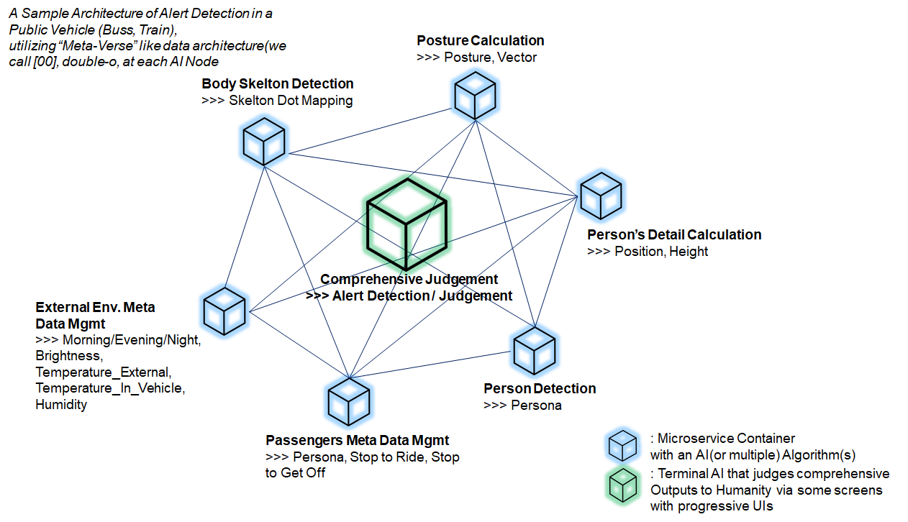

  

  Nascent Architecture and Styled Formats for Omniverse Data Cluster

***  

# double-o 
double-oは、主にエッジコンピューティング環境において、産業用・自動運転用に定義されたデータフォーマットを格納したレポジトリです。 
各データフォーマットは、クラウド環境においても適用可能です。  

## double-oに含まれるアーキテクチャの一例
以下の図は、本レポジトリにデータフォーマットとして格納されている、公共交通機関（バス/電車等）におけるアラート検出のアーキテクチャです。  

## データフォーマットの一覧
本レポジトリに含まれるデータフォーマットは、以下の通りです。  

* comprehensive_judgement_meta_data_sample.json  

